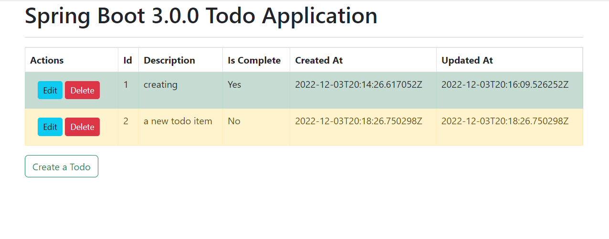

# Spring Boot 3 Todo Application

This is an ENTIRE application for Java Spring Boot built using:
- Spring Boot 3.0.0
- Spring Data JPA
- H2 Database
- Thymeleaf

## Development Instructions

- `git clone https://github.com/atharvad065/Springboot-TODO-Application.git`
- `cd spring-boot-3-todo-application`
- open in favorite editor, or
- `mvnw spring-boot:run`
- open http://localhost:8025 and the application should be running

